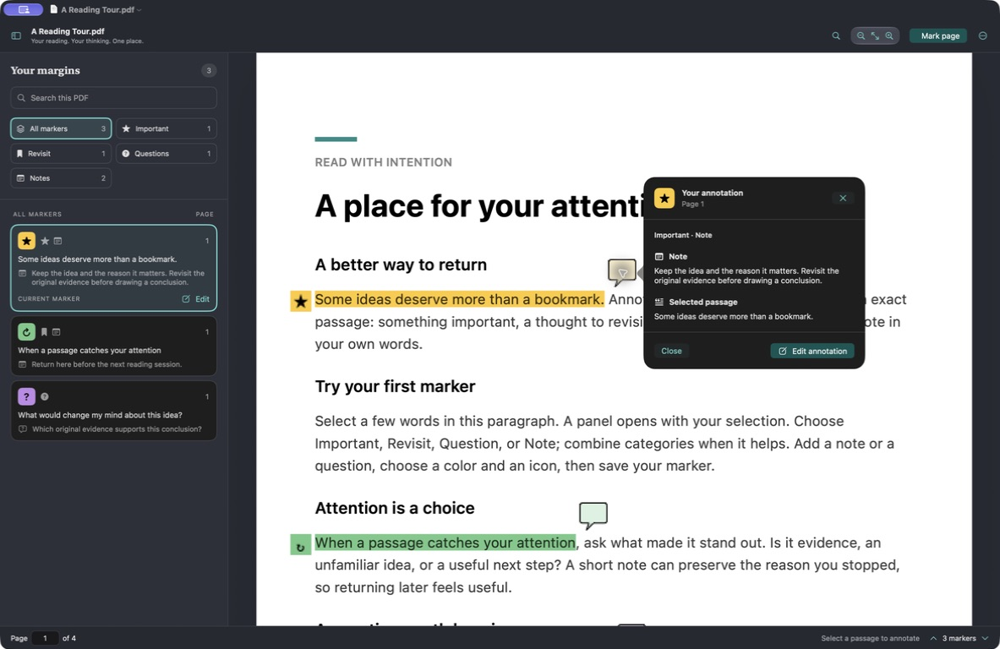

# Annotate 1.0.1 — note readability verification

Verified September 5, 2026 on macOS 27.0 (26A5425a), Apple silicon, using Xcode 27 / Swift 6.4 with a macOS 26 deployment target.

## Delivered behavior

Clicking an Annotate note tag or margin badge opens a neutral details panel with readable note, question, and selected-passage sections. Close and Edit controls use independent, contrasting colors. Long writing scrolls without hiding the footer. Editing uses the current structured marker; changed drafts are preserved, and Undo/delete dismiss stale details.

The review also improved marker glyphs and swatch checkmarks for custom dark colors, teal controls in light appearance, category/icon selected states, Increase Contrast outlines, and search-result emphasis. Standard PDF comment tags preserve notes for other readers. Older editable documents receive updated marker appearances on load; normal saving persists those updates.

## Build and installation

- Installed and launched `/Applications/Annotate.app`, version **1.0.1 (2)**.
- Optimized release build and strict ad-hoc code-signature verification passed.
- Build and installed executables have identical SHA-256: `1d152f345d80791e5039711b572b5776243c50f8a0890f50823f4bca027f83ae`.
- Previous installed bundle is retained as a timestamped backup in the ignored `build` directory.
- Logs: ignored `TestResults/polish-swift-test.log` and `TestResults/polish-install.log`.

## Automated verification

The complete suite passed **57 test functions in 10 suites, covering 137 scenarios**: 33 core tests and 24 app tests. No compiler warnings were reported. Existing persistence, search, undo/redo, document lifecycle, permissions and flattened-export checks passed with the new regression coverage detailed in the [test plan](TEST_PLAN.md).

Tests inspect actual PDFKit hit targets, saved/reopened documents, and rendered PDF pixels. They cover light/dark panel layout and native color resolution, 80-paragraph scrolling, legacy migration, 12 zoom/rotation hit combinations, eight crop/rotation placements, and repeated popup cleanup without touching foreign annotations.

## Observed macOS interactions

- Reproduced the original PDFKit popup with yellow background and unreadable yellow/white Done button.
- Verified direct tag and badge clicks open Annotate's neutral panel, including repeated clicks on different notes.
- Dragged from inside an existing highlight into surrounding text: the correct passage was selected and the annotation editor opened.
- With an unsaved note draft, opening details disabled Edit; Escape closed only details and retained the draft text.
- Edited a note through the new panel, saved it, then reopened the PDF in the installed Applications copy. The complete revised note appeared in the new panel.
- Verified the installed binary's path, version and hash separately from the development bundle.
- Stopped the awake-session guard after UI verification.

The live Mac used its existing dark appearance. Light appearance and long-note scrolling were verified in native hosted-view tests; this was not a full manual light-mode or spoken VoiceOver audit. Physical printer output, macOS 26 runtime execution, Intel builds, and notarized distribution remain outside this verification. Unowned legacy popup objects whose parent links PDFKit does not expose are conservatively preserved rather than guessed at and removed.

## Original references

Three primary sources informed this change, alongside local Apple SDK headers and executable tests:

1. [Apple NSView.hitTest](https://developer.apple.com/documentation/appkit/nsview/hittest(_:)) — public routing of mouse-down events to a view.
2. [Apple PDFAnnotation](https://developer.apple.com/documentation/pdfkit/pdfannotation) — standard annotation types, bounds, contents, and popup relationships.
3. [W3C contrast guidance](https://www.w3.org/WAI/WCAG22/Understanding/contrast-minimum.html) — relative luminance and minimum text contrast. The numerical checks support these specific controls and glyphs; they are not a claim of complete accessibility conformance.
