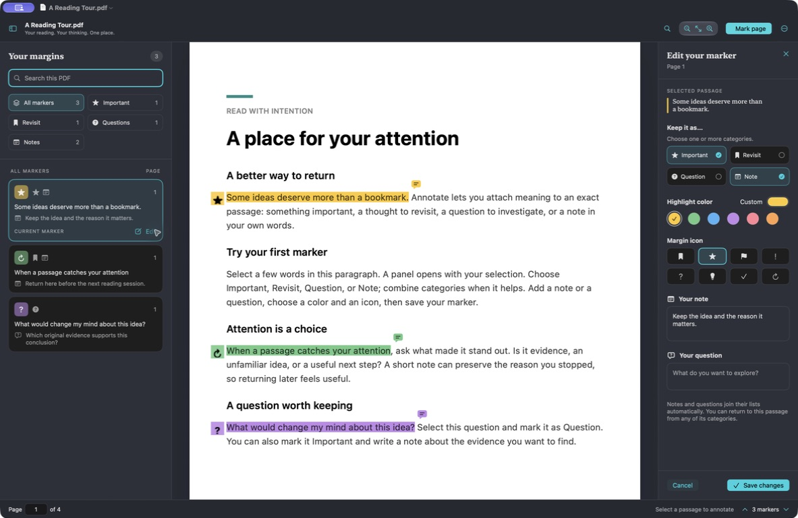

# Annotate

A native macOS PDF reader for thoughtful reading. Select a passage, keep what matters, and return to the exact place later.



*The Annotate app, with its built-in reading guide.*

Annotate brings important passages, revisit lists, questions, and notes into one reading workflow. Built entirely in Swift using Apple's SwiftUI, AppKit, PDFKit, Core Graphics, and Core Text, with native macOS controls and Liquid Glass accents. No third-party dependencies, accounts, cloud services, or network requests.

## Features

- **Mark a passage in place.** Selecting text opens a slide-out editor with categories, highlight colors, a custom color picker, and marker icons.
- **Keep related thoughts together.** A passage can be Important and Revisit at the same time, with both a note and a question attached.
- **Return to the exact spot.** Browse category lists, click any marker, or step through the current list with next/previous shortcuts. Location markers also work on image-only pages.
- **Search with context.** A slide-out search panel shows a clickable snippet for each occurrence.
- **Keep your work in the PDF.** Editable markers travel inside the document, with native autosave, multiple windows, and undo/redo.
- **Print and share.** Print visible annotations or export a PDF with marks baked into its pages and a complete notes-and-questions index.

## Get started

Requires **macOS 26 or newer** and a Swift 6.2+ toolchain with the macOS 26 SDK or newer. Development and verification used **Xcode 27 / Swift 6.4 on macOS 27**; macOS 26 runtime behavior and Intel builds have not yet been verified.

```sh
git clone https://github.com/mweingartner/annotate.git
cd annotate
swift test
./Scripts/build.sh
open build/Annotate.app
```

You can also open `Package.swift` in Xcode. To install your local build, drag `build/Annotate.app` into Applications.

The application and test harness are Swift. The small build script assembles and locally signs the app bundle using Apple's tools; this is an ad-hoc signed build, not a notarized distribution release. The app icon is generated by `Scripts/GenerateIcon.swift`.

## Read and mark

- **Open PDF** or try the built-in reading guide.
- Select text in the PDF. A panel slides out after the selection finishes.
- Choose any combination of **Important**, **Revisit**, **Question**, and **Note**. Add a note and question to any passage independently.
- Choose a highlight color, use the system color picker for a custom color, and choose a marker icon.
- Click **Save Marker**. The navigation panel lists your markers; click a row to return to the precise location. Use its edit action to revise a marker.
- Use **Mark Current Location** for a scanned page or a place without selectable text.
- Filter the panel to important passages, revisit items, questions, or notes. Next/previous marker navigation follows the selected filter.
- Search shows a clickable result for each occurrence with the matching text in context.

## Save, print, share

Annotate uses the native macOS document system, including autosave, save dialogs, multiple document windows, and undo/redo for marker changes. Opened PDFs autosave in place; use **Save As** first to work on a separate editable copy. Marker metadata lives inside standard PDF annotations, so the editable document does not depend on sidecar files or an app database. Changes still in the annotation panel must be added with Save Marker; closing a document with changed draft fields asks what to do.

**Save** retains editable highlights and marker metadata. Other PDF viewers can display the highlights and printable symbol badges. Notes and questions are also stored in the highlight annotation's contents. Software that removes custom PDF annotation keys may remove Annotate's category/navigation metadata.

**Export Annotated PDF** makes a separate sharing copy: visible annotations are drawn permanently into page content, and a paginated annotation index contains the complete passages, notes, questions, and original page references. This copy contains no interactive annotation objects. Keep the editable original to make future changes. Export requires a PDF that allows printing and copying.

**Print** opens the system print panel and prints the PDF with visible annotations. To print the full notes and questions index too, export the sharing copy and print that file.

## Keyboard shortcuts

| Action | Shortcut |
| --- | --- |
| Open PDF | ⌘O |
| Save | ⌘S |
| Save As | ⇧⌘S |
| Search PDF | ⌘F |
| Add location marker | ⇧⌘M |
| Previous / next marker | ⌥⌘[ / ⌥⌘] |
| Toggle navigation panel | ⌥⌘S |
| Export sharing copy | ⇧⌘E |
| Print | ⌘P |
| Undo / redo marker change | ⌘Z / ⇧⌘Z |
| Zoom in / out / fit width | ⌘+ / ⌘− / ⌘0 |

## Testing and implementation

The test harness uses real PDFKit documents and generated fixtures to exercise marker persistence, multi-page selections, category membership, attached writing, undo/redo, malformed metadata, search, PDF permissions, document lifecycle, and flattened export. The recorded verification run passed **35 test functions covering 52 scenarios**; its scope and remaining gaps are documented in the [verification report](Docs/VERIFICATION.md).

See the [architecture and Apple API references](Docs/ARCHITECTURE.md) and [test plan](Docs/TEST_PLAN.md) for implementation details and reproducible checks. The architecture and testing documentation reference **10 distinct original Apple sources**.

## Practical limits

Text selection and text search require a PDF text layer; this release does not perform OCR. Image-only pages support location markers. The app respects PDF commenting, printing, and copying permissions. Flattened exports retain vector/text content where PDFKit's renderer supports it; interactive forms, links, and annotation popovers are intentionally flattened for sharing. Very large PDFs and accessibility behavior beyond the tested paths remain areas for broader real-world validation.

## License

Annotate is available under the [MIT License](LICENSE).
