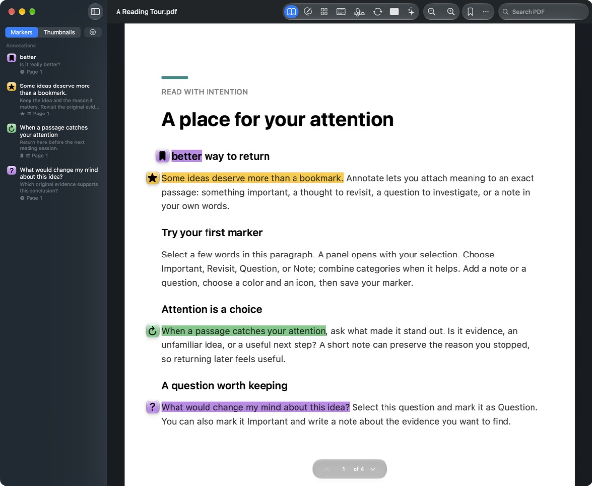

# Annotate

A native macOS PDF workspace for reading, marking, editing in place, page organization, forms, signatures, conversion, OCR, and document conversations.



*The reader follows the macOS glass look: a unified toolbar, a sidebar of bookmarks and annotations, and marker pins beside the passages they belong to ([interface design](Docs/INTERFACE_DESIGN.md)).*

Annotate is written in Swift using Apple's SwiftUI, AppKit, PDFKit, Core Graphics, Core Text, Vision, FoundationModels, and Security frameworks. It has no third-party runtime dependencies, ads, account requirement, or export watermarks. PDF tools run locally. AI can use **local Ollama**, **OpenAI API**, **Claude API**, or **Apple Intelligence** when available.

## Highlights

- **Edit text where it is.** Click a paragraph and type. The edit is set exactly like the original: same font (or the closest installed match), baselines, margins, alignment and line breaks. It is saved as real, selectable PDF text.
- **Minimal reflow.** When an edited paragraph gains or loses a line, only the content below it moves, by exactly that line, as far as the first gap that absorbs the change. Rules, images and annotations move with their text.
- **Markers that read like margin notes.** Important, Revisit, Question, and Note markers with custom colors and icons, glass pins on the page, a sidebar to jump between them, and an annotated export with a notes-and-questions index.
- **A full PDF workspace.** Reorder, insert, rotate, split and merge pages; create and fill forms; sign visibly or with a certificate; convert to 13 formats; OCR scans; export redacted copies.
- **An assistant that shows its sources.** Ask, summarize, or translate with local or cloud models. Every answer links back to the pages and passages it used, and cloud requests are reviewed before they are sent.

## Work with PDFs

| Tool | What it does |
| --- | --- |
| Read and mark | Bookmarks for pages and annotations for passages, shown as glass pins on the page and listed in the sidebar. Composable Important, Revisit, Question, and Note categories; custom colors/icons; exact passage navigation; contextual search; page thumbnails; readable note popovers. |
| Edit | Click a paragraph to edit its text where it is, with a floating format bar; the inspector holds every control. Edits keep the original's font, baselines, margins and alignment, and the content below moves only as much as the new text needs. Change installed font family/typeface, size, color, bold, italic, underline, alignment, letter/line/paragraph spacing, position, and dimensions for selected text runs. Select existing images to replace, remove, move, or resize their source content. Insert native text or images; add standard highlights, underlines, strikeouts, rectangles, and ellipses. |
| Pages | Thumbnail navigation and drag reordering; accessible move buttons; insert PDFs, images, and blank pages; merge, rotate, delete, extract, and split. Marker references follow the pages. |
| Forms | Create and fill text, checkbox, radio, dropdown, and list-box fields; use live text for noninteractive forms. |
| Sign | Type, draw, or import a visible electronic signature; sign a copy with a certificate and validate signed files. |
| Convert & OCR | Explicit output formats, quality options, measured compression results, whole-document OCR, and batch results with unique output names. |
| Redact | Queue selected text/areas and export a fresh PDF whose removed pixels cannot be recovered from the output image. |
| Assistant | Ask questions, summarize all text sections, find key details, explain or translate a selection, and inspect source passages with page navigation. |

The [workspace design](Docs/WORKSPACE_DESIGN.md), [native text engine](Docs/NATIVE_TEXT_EDITING.md), [typography controls](Docs/TYPOGRAPHY_DESIGN.md), [conversion design](Docs/CONVERSION_DESIGN.md), [pages/forms design](Docs/PAGES_FORMS_DESIGN.md), and [assistant design](Docs/ASSISTANT_DESIGN.md) describe behavior and its practical limits. The [PDFgear comparison](Docs/PDFGEAR_RESEARCH.md) checks the requested reference against **10 original sources**, including contradictory marketing claims. Annotate does **not** claim complete PDFgear feature or fidelity parity.

## Install

Annotate runs on **macOS 26 or newer** on **Apple Silicon** Macs.

### Download the app

1. Download `Annotate-<version>-macOS-arm64.zip` from the [latest release](https://github.com/mweingartner/annotate/releases/latest).
2. Open the zip and drag **Annotate.app** into your **Applications** folder.
3. Open Annotate. Release builds are ad-hoc signed, not notarized by Apple, so the first launch is blocked with a message that Apple could not verify the app. Choose **Done**, then open **System Settings › Privacy & Security**, scroll to Security, and choose **Open Anyway** for Annotate. You only need to do this once.

If you prefer the terminal, you can instead clear the download flag after copying the app, and then open it normally:

```sh
xattr -dr com.apple.quarantine /Applications/Annotate.app
```

Each release lists the zip's SHA-256 checksum; `shasum -a 256 Annotate-<version>-macOS-arm64.zip` should print the same value.

### Build from source

Building requires Swift 6.2+ with the **macOS 26.4 SDK or newer** (Xcode 26.4 or later). Development and runtime verification use **Xcode 27 / Swift 6.4 on Apple Silicon macOS 27**. Older eligible SDKs, macOS 26 runtime behavior, and Intel Macs require separate validation.

```sh
git clone https://github.com/mweingartner/annotate.git
cd annotate
swift test
./Scripts/build.sh
open build/Annotate.app
```

To build and install in `/Applications/Annotate.app`, quit Annotate normally, then run:

```sh
./Scripts/install.sh
```

The installer keeps a timestamped backup of the previous application under `build/`. Builds you make yourself are signed for your Mac only and open without the Privacy & Security step. The application and automated tests are Swift; shell scripts invoke Apple's build and packaging tools.

### Updating

Quit Annotate, then replace the app in Applications with the newer download (or run `./Scripts/install.sh` again from an updated clone). Your PDFs, markers, and settings are kept: markers live inside the PDFs themselves, and API keys stay in your Keychain.

## Live editing and saving

Choose **Edit** and click a paragraph to edit it in place, with the insertion point where you clicked; drag across words to edit only those. The page shows your edits in their real fonts as you type, with a quiet outline around the block and a floating format bar. Press Escape, choose Done, or click elsewhere when you are done. Selecting a passage in Read mode opens the marker editor, where **Edit PDF Text** takes you directly into text editing. The inspector's **Text in a list** shares the same rich text and character selection for VoiceOver or larger type. Select characters to change their font, size, color, bold, italic, underline, paragraph alignment, or spacing. With an insertion point, formatting controls apply to the whole block. Use **Add text box** for new native text. Select saved text to edit it again, or click an existing FreeText annotation while Edit is active.

**Text edits remove the selected source glyphs and save replacement text as native PDF text.** Surrounding text, vectors, images, and annotations are preserved through the content engine. This supports ordinary selectable horizontal text, including embedded subset fonts and positioned text. The editor reads actual source typefaces and effective sizes; unavailable installed fonts produce an explicit substitution notice. Edits are set exactly like the original: same font (or the closest installed match, named in the inspector), baselines, margins, alignment (left, justified, centred or right), first-line indent and line breaks. A paragraph rewraps within its own width. When it gains or loses a line, the content below it moves by exactly that amount, text, rules, images and annotations together, as far as the first gap wide enough to absorb the change; nothing beyond that gap moves, and an edit that keeps the line count moves nothing. When the content below can't move (the page ends, or it is clipped, shaded or spans the paragraph), nothing moves and the overflow mark gives the reason. A block you move or resize by hand keeps that geometry and moves nothing. Position and size fields provide precise placement; **Fit text height** sizes the block within the page. Unsupported encodings or content structures, ambiguous selections, and overflow fail visibly, with pending text retained for correction or discard.

OCR makes scans searchable. A selection in an invisible OCR layer offers a separate **Edit scanned text** action: it replaces the selected words in the original scan image and inserts visible, selectable PDF text. This requires one supported RGB/grayscale image, a flat paper background, and a precise OCR selection; skewed images, masks, patterned backgrounds, overlapping content, colored artwork, and selections too close to image edges are refused. Rewriting the source image losslessly can increase file size. Ordinary text editing never changes scan pixels implicitly. See the [native text design](Docs/NATIVE_TEXT_EDITING.md) for exact limits.

**Images on page** lists existing source images with page-area thumbnails. Selecting one reveals its location and controls for replacement, removal, position, and size. Frame proportions can be locked. **Apply image changes** commits replacement and geometry together as one undoable PDF change; pending controls are retained on failure, and must be applied or discarded before saving or closing. Replacements fill the current frame. Images with clipping or skew can be replaced in place or removed, with movement limits stated beside the controls. Thumbnails can include overlapping page content. Vector artwork is separate from image content. See the [image editing design](Docs/IMAGE_EDITING_DESIGN.md). Image insertion preserves source vector text.

`NSDocument` owns native save/autosave, document windows, and undo/redo. Opened PDFs autosave in place: use **Save As** first if you want a separate editable original. Workspace mutations use independent working copies and complete PDF undo snapshots. Failed operations leave the original document untouched. Pending marker drafts retain their existing save/discard/cancel behavior.

**Save** retains native text edits, editable annotations, and marker metadata. An unapplied text edit must be corrected or discarded before saving or leaving its editor. **Export Annotated PDF** creates a separate flattened sharing copy with a paginated notes-and-questions index. **Print** uses the system print panel. Derived exports refuse to overwrite the currently open source path. PDF editing, assembly, form-entry, copying, and printing permissions are checked separately.

Sidebar search includes visible text boxes and filled text/choice fields and navigates to their page areas. Text exports and AI evidence include those values after the original page text in labeled reading order. Hidden annotations, marker badges, and password fields are excluded. Text inside page images still requires OCR; the assistant does not inspect image pixels.

## Choose your AI provider

Open **Assistant** and choose the provider above the question composer. **Settings** exposes the model and connection details. API keys are stored only in Annotate's macOS Keychain service; they are not embedded in PDFs or saved in repository files.

- **Ollama:** start Ollama and download a model, then use **Find installed models** in Settings. Annotate connects to a loopback address and checks that the model is locally downloaded before sending PDF text. It does not install models or use Ollama cloud aliases.
- **OpenAI API:** enter an API key and a Responses-compatible model. Requests go to OpenAI with Responses storage disabled. Account/model access and API billing are separate from a ChatGPT subscription.
- **Claude API:** enter an API key, model, and workspace ID if required by that key. Requests go to Anthropic's Messages API.
- **Apple Intelligence:** uses the system on-device model when the Mac and system configuration support it. The panel reports unavailability instead of pretending generation succeeded.

For **Ollama** and **Apple Intelligence**, **Ask**, **Summarize**, and **Key details** read the evidence and generate locally in one explicit action. The newest answer includes clickable source pages and expandable original passages. **More actions** provides selection explanation, translation, and **Find sources**, which searches the PDF locally without a model.

For **OpenAI API** and **Claude API**, the first action prepares evidence locally and opens **Review before sending**. Inspect the passages and request details, including page coverage, model, request count, source size, and output-token allowance. Only the separate **Send to OpenAI API** or **Send to Claude API** action transmits that request and may incur API charges. Choosing providers or preparing evidence does not upload the PDF. There are no automatic paid retries. Cancellation cannot retract a request already accepted by a provider.

The assistant checks every page during extraction and reports image-only pages needing OCR. Questions use a disclosed lexical-retrieval subset; full summaries process every text section separately. Context and input limits are explicit. Generated answers may be wrong; inspect the source passages. No model gets tools, file access, or permission to edit the PDF.

## Redaction and format limits

**Export Redacted Copy** creates a new image-only PDF after blackening selected pixels in a bitmap. It carries over no source text layer, interactive annotations, metadata, attachments, or editing history. The open original remains unredacted. Verify the exported file before sharing it. The operation removes interactivity and searchable text throughout the sanitized copy.

Conversion offers 13 output types: PDF, DOCX, DOC, ODT, RTF, TXT, HTML, XLSX, PPTX, PNG, JPEG, TIFF, and HEIC. XLSX contains editable text cells on one worksheet per page, with tab/repeated-space column detection; it does not infer formulas or guarantee table reconstruction. PPTX contains one rendered PDF page per slide, preserving appearance rather than editable slide objects. Excel/PowerPoint input files must first be exported to PDF in their originating app. Word/RTF/OpenDocument/HTML exports preserve available text styling in reading order, not complex page layout, image placement, or reconstructed tables. Scans require OCR for text export. Compression reports actual before/after byte counts; some PDFs cannot be reduced. See the conversion design for the exact current formats and Office fidelity limits.

Typed, drawn, and image signatures provide visible electronic appearances. The **Sign** panel also offers certificate signing: explicitly load Keychain identities, choose a certificate, then **Sign a copy…**. It creates a detached SHA-256 approval signature without modifying the original. **Validate a signed PDF…** checks the file's original bytes and reports integrity, certificate trust on this Mac, and unsigned appended changes separately. Self-signed certificates are reported as untrusted. Encrypted PDFs, incremental co-signing, trusted timestamps, online revocation, and long-term archival validation are unsupported. See [certificate design and verification](Docs/CERTIFICATE_SIGNATURES.md).

PDFKit form behavior and external-reader interoperability vary; radio controls require particular attention when exchanged with another reader. The app covers the reference product's major workflows with the stated format, fidelity, and signature limits.

## Shortcuts

| Action | Shortcut |
| --- | --- |
| New PDF / open PDF | ⌘N / ⌘O |
| Save / Save As | ⌘S / ⇧⌘S |
| Edit PDF / document assistant | ⌥⌘E / ⌥⌘J |
| Search | ⌘F |
| Bookmark this page | ⇧⌘M |
| Previous / next marker | ⌥⌘[ / ⌥⌘] |
| Show or hide sidebar | ⌃⌘S |
| Export annotated PDF / print | ⇧⌘E / ⌘P |
| Undo / redo | ⌘Z / ⇧⌘Z |
| Zoom in / out / fit | ⌘+ / ⌘− / ⌘0 |

## Verification and security

The Swift Testing harness uses generated real PDFs, scanned fixtures, reopened outputs, pixel assertions, and provider transport fixtures. It exercises marker compatibility, complete workspace undo, page remapping, forms, signature appearances, conversions, OCR geometry, sanitization, AI coverage/cancellation, and secret-handling boundaries. See [workspace verification](Docs/WORKSPACE_VERIFICATION.md) for the exact latest results and runtime scope.

Tests do not invoke paid AI APIs. The optional local test uses an already-running Ollama installation:

```sh
ANNOTATE_LOCAL_AI_SMOKE=1 ANNOTATE_LOCAL_AI_MODEL=granite4.1:8b swift test --filter AssistantLocalSmokeTests
```

PDFs are treated as untrusted:

- **Links** open only for web and mail addresses, and only after you see the full address and agree. Links to local files, network shares, other apps, or other PDF files are refused.
- **Editing** works within fixed limits on form nesting and reuse, operators, decoded bytes, fonts, width tables, and marker metadata, and refuses streams compressed more than once, so a crafted file can't freeze the app. Edits leave no copy of the replaced content behind in thumbnails, alternative resource names, or marker quotes.
- **Exports** never overwrite the open original, however its path is spelled.
- **AI keys** stay in the Keychain and are sent only to their provider. Ollama is reached only on this Mac, and redirects are never followed.

See [SECURITY.md](SECURITY.md) and [private vulnerability reporting](https://github.com/mweingartner/annotate/security/advisories/new). Annotate is available under the [MIT License](LICENSE).
